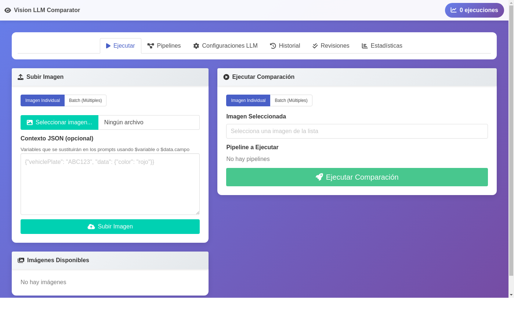
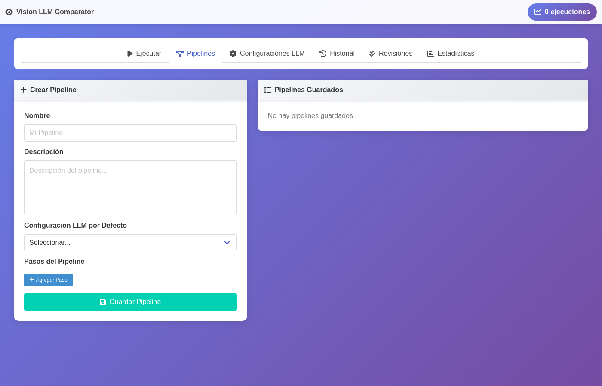
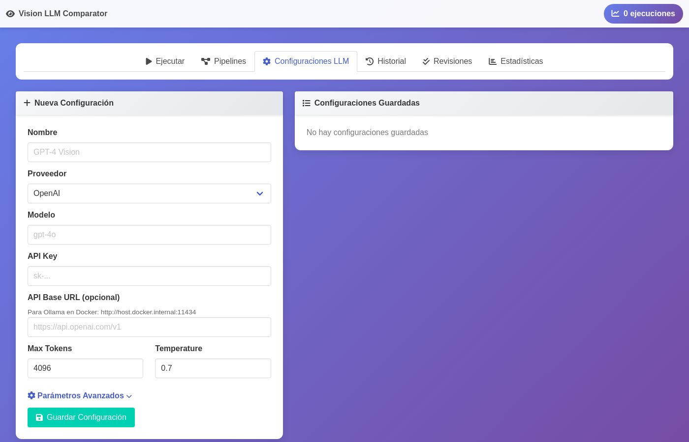
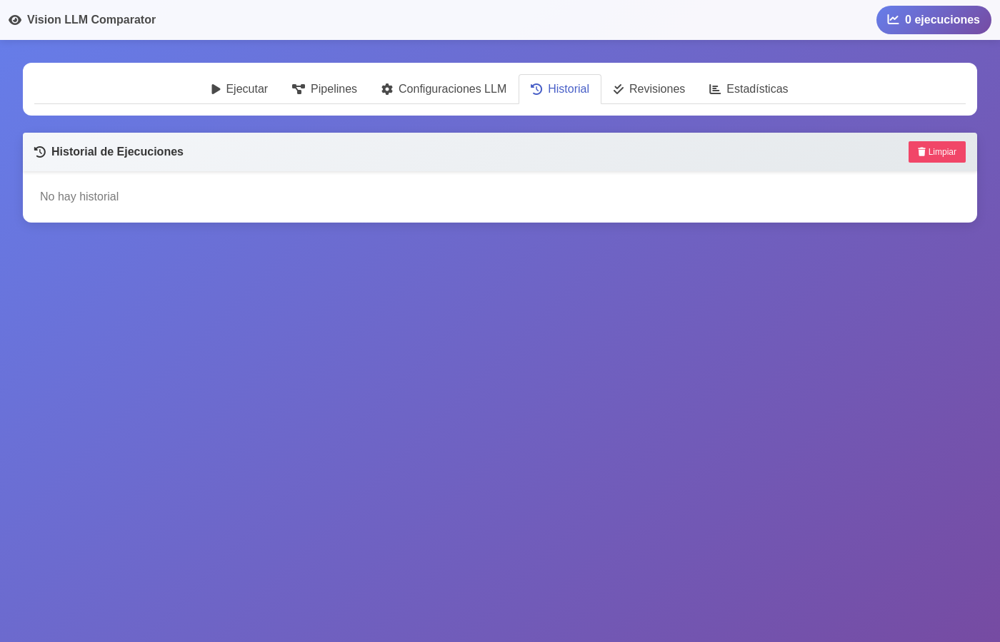
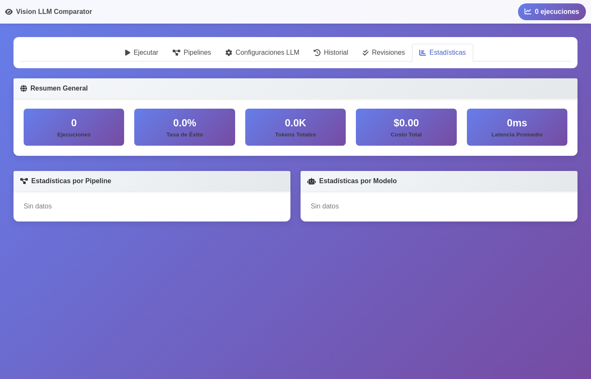

# Vision LLM Comparator

Una aplicación Python con interfaz gráfica web para comparar LLMs visuales mediante pipelines configurables. Permite evaluar diferentes modelos de visión procesando imágenes y comparando sus resultados en términos de calidad, tiempo, tokens y costo.

## Screenshots

### Pantalla Principal - Ejecutar

*Interfaz principal para subir imágenes y ejecutar comparaciones de pipelines.*

### Configuración de Pipelines

*Creación y gestión de pipelines con múltiples pasos de análisis.*

### Configuración de LLMs

*Configuración de proveedores de LLM (OpenAI, Anthropic, Google, Ollama) con parámetros avanzados.*

### Historial de Ejecuciones

*Historial completo de todas las ejecuciones con opción de generar reportes PDF forenses.*

### Estadísticas y Métricas

*Dashboard con métricas de rendimiento, costos y estadísticas por pipeline y modelo.*

## Características Principales

### Soporte Multi-Proveedor
- **OpenAI**: GPT-4o, GPT-4o-mini, GPT-4 Turbo, GPT-5
- **Anthropic**: Claude 3.5 Sonnet, Claude 3 Opus, Claude 3 Haiku
- **Google**: Gemini Pro Vision, Gemini 1.5, Gemini 2.0
- **Ollama**: Modelos locales (LLaVA, Llama Vision, etc.)
- **OpenAI Compatible**: Cualquier API compatible

### Sistema de Pipelines Avanzado
- **Múltiples pasos**: Crea secuencias de análisis encadenados
- **Modelo por paso**: Cada paso puede usar un LLM diferente
- **Variables JSON**: Sustituye variables en prompts usando `$variable` o `$data.campo`
- **Contexto encadenado**: Usa la salida del paso anterior como entrada

### Procesamiento Batch
- Procesa múltiples imágenes con un solo pipeline
- Asocia archivos JSON de contexto a cada imagen
- Reportes agregados de batch

### Reportes PDF Forenses
- Genera reportes PDF firmados con hash SHA-256
- Incluye imagen analizada con hash de integridad
- Detalla cada paso del pipeline con métricas
- Ideal para procesos de auditoría y revisión forense

### Sistema de Revisión
- Marca cada paso como correcto/incorrecto
- Métricas de precisión por pipeline y modelo
- Identifica qué modelos funcionan mejor para cada tarea

### Métricas Detalladas
- Latencia por paso y total
- Tokens de entrada/salida
- Estimación de costos
- Comparación lado a lado

### Historial Completo
- Guarda todas las ejecuciones
- Detalles completos de cada paso
- Prompts usados (con variables sustituidas)
- Estadísticas agregadas

## Instalación

### Opción 1: Docker (Recomendado)

#### Requisitos Previos
- Docker Engine 20.10+
- Docker Compose v2.0+

#### Inicio Rápido

```bash
# Clonar el repositorio
git clone https://github.com/vtomasv/vision-arena.git
cd vision-arena

# Construir y ejecutar
docker compose up -d

# La aplicación estará disponible en http://localhost:8000
```

#### Configuración con Variables de Entorno

Crea un archivo `.env` en el directorio del proyecto:

```env
# API Keys (opcional, también se pueden configurar en la UI)
OPENAI_API_KEY=sk-...
ANTHROPIC_API_KEY=sk-ant-...
GOOGLE_API_KEY=...

# Directorio de datos (opcional)
VISION_LLM_DATA_DIR=/data
```

#### Uso con Ollama Local

Para usar modelos locales de Ollama desde Docker:

1. Asegúrate de que Ollama esté corriendo en tu máquina host
2. Configura el LLM con API Base: `http://host.docker.internal:11434`

```bash
# En tu máquina host, inicia Ollama
ollama serve

# Descarga un modelo con visión
ollama pull llava
```

#### Comandos Docker Útiles

```bash
# Ver logs
docker compose logs -f

# Detener
docker compose down

# Reconstruir después de cambios
docker compose up -d --build

# Limpiar todo (incluyendo datos)
docker compose down -v
```

#### Backup y Restauración

Los datos se almacenan en un volumen Docker llamado `vision-data`:

```bash
# Backup
docker run --rm -v vision-arena_vision-data:/data -v $(pwd):/backup alpine tar czf /backup/vision-backup.tar.gz /data

# Restaurar
docker run --rm -v vision-arena_vision-data:/data -v $(pwd):/backup alpine tar xzf /backup/vision-backup.tar.gz -C /
```

### Opción 2: Instalación Local

#### Requisitos
- Python 3.10+
- pip

#### Pasos

```bash
# Clonar el repositorio
git clone https://github.com/vtomasv/vision-arena.git
cd vision-arena

# Instalar dependencias
pip install -r requirements.txt

# Ejecutar
python app.py

# Abrir http://localhost:8000
```

## Uso

### 1. Configurar LLMs

1. Ve a la pestaña **"Configuraciones LLM"**
2. Agrega las configuraciones de los modelos que quieras usar:
   - **Nombre**: Identificador único (ej: "GPT-4 Vision")
   - **Proveedor**: OpenAI, Anthropic, Google, Ollama
   - **Modelo**: Nombre del modelo (ej: "gpt-4o")
   - **API Key**: Tu clave de API
   - **API Base**: URL personalizada (para Ollama: `http://host.docker.internal:11434`)

### 2. Crear Pipelines

1. Ve a la pestaña **"Pipelines"**
2. Crea un nuevo pipeline:
   - **Nombre y descripción**
   - **LLM por defecto**: Se usará si un paso no especifica otro
   - **Pasos**: Agrega los pasos de análisis

#### Ejemplo de Pipeline con Variables

```
Paso 1: Identificación
Prompt: "Identifica el vehículo en la imagen. La placa esperada es $vehiclePlate"
LLM: GPT-4o-mini (rápido para identificación)

Paso 2: Análisis Detallado
Prompt: "Analiza el estado del vehículo. Color esperado: $data.color"
LLM: GPT-4o (más preciso para análisis)
Usar salida anterior: ✓
```

### 3. Subir Imágenes

#### Imagen Individual
1. Ve a **"Ejecutar"**
2. Sube una imagen
3. Opcionalmente, agrega contexto JSON:
```json
{
  "vehiclePlate": "ABC123",
  "data": {
    "color": "rojo",
    "year": 2020
  }
}
```

#### Batch de Imágenes
1. Selecciona la pestaña "Batch"
2. Sube múltiples archivos:
   - `foto01.jpg` + `foto01.json`
   - `foto02.jpg` + `foto02.json`
3. Los JSON se asocian automáticamente por nombre

### 4. Ejecutar Comparación

1. Selecciona una imagen
2. Marca los pipelines a comparar
3. Click en **"Ejecutar Comparación"**
4. Revisa los resultados:
   - Tiempo de cada paso
   - Tokens consumidos
   - Respuestas de cada modelo
   - Comparación de métricas

### 5. Generar Reporte PDF Forense

1. Ve a **"Historial"**
2. Selecciona una ejecución
3. Click en **"Descargar Reporte Forense PDF"**
4. El PDF incluye:
   - Imagen con hash SHA-256
   - Contexto JSON de entrada
   - Resultados de cada paso
   - Firma digital del reporte

### 6. Revisar Resultados

1. Ve a **"Revisiones"**
2. Selecciona una ejecución pendiente
3. Marca cada paso como correcto/incorrecto
4. Las métricas de precisión se actualizan automáticamente

### 7. Analizar Estadísticas

La pestaña **"Estadísticas"** muestra:
- Total de ejecuciones
- Tasa de éxito
- Tokens y costos totales
- Rendimiento por pipeline
- Rendimiento por modelo
- Precisión basada en revisiones

## Estructura del Proyecto

```
vision-arena/
├── app.py              # Aplicación FastAPI con UI web
├── llm_providers.py    # Proveedores de LLM (OpenAI, Anthropic, etc.)
├── pipeline.py         # Sistema de pipelines y comparación
├── storage.py          # Persistencia de datos
├── pdf_generator.py    # Generador de reportes PDF forenses
├── requirements.txt    # Dependencias Python
├── Dockerfile          # Imagen Docker
├── docker-compose.yml  # Configuración Docker Compose
├── docs/
│   └── screenshots/    # Capturas de pantalla
└── README.md           # Esta documentación
```

## API REST

La aplicación expone una API REST completa:

### Configuraciones LLM
- `GET /api/configs` - Listar configuraciones
- `POST /api/configs` - Crear configuración
- `PUT /api/configs/{name}` - Actualizar configuración
- `DELETE /api/configs/{name}` - Eliminar configuración

### Pipelines
- `GET /api/pipelines` - Listar pipelines
- `POST /api/pipelines` - Crear pipeline
- `GET /api/pipelines/{id}` - Obtener pipeline
- `PUT /api/pipelines/{id}` - Actualizar pipeline
- `DELETE /api/pipelines/{id}` - Eliminar pipeline

### Imágenes
- `POST /api/images/upload` - Subir imagen individual
- `POST /api/images/upload-batch` - Subir batch de imágenes
- `GET /api/images` - Listar imágenes
- `GET /api/images/view/{filename}` - Ver imagen

### Ejecución
- `POST /api/execute` - Ejecutar comparación
- `POST /api/execute-batch` - Ejecutar batch
- `GET /api/execute/{id}/status` - Estado de ejecución

### Historial
- `GET /api/history` - Listar historial
- `GET /api/history/{id}` - Detalles de ejecución
- `GET /api/history/{id}/pdf` - Generar reporte PDF forense
- `DELETE /api/history` - Limpiar historial

### Revisiones
- `POST /api/reviews` - Revisar paso
- `GET /api/reviews/statistics` - Estadísticas de precisión

### Estadísticas
- `GET /api/statistics` - Estadísticas generales

## Solución de Problemas

### Docker no puede conectar con Ollama
- Verifica que Ollama esté corriendo: `ollama serve`
- Usa `http://host.docker.internal:11434` como API Base
- En Linux, puede ser necesario usar la IP del host

### Error de API Key
- Verifica que la API key sea correcta
- Asegúrate de que el modelo tenga capacidades de visión

### Imágenes no se procesan
- Formatos soportados: JPG, PNG, GIF, WebP
- Tamaño máximo recomendado: 20MB

### Errores de memoria
- Reduce `max_tokens` en la configuración
- Usa modelos más pequeños para pasos intermedios

### Error "unsupported_parameter" con GPT-5
- Deja Max Tokens en 0 para usar el default del modelo
- Los modelos nuevos usan `max_completion_tokens` automáticamente

## Licencia

MIT License
